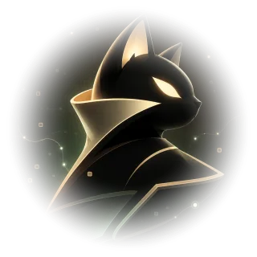

  

 

## 🛠️ Tech Stack

  

## 🌟 Featured Projects

&nbsp;&nbsp;&nbsp;&nbsp;

### 🤖 [TypeScript Agent Runtime](https://github.com/mufeiyu-ayu/agent)

A full-stack AI agent runtime hand-built from scratch — no LangChain, no workflow engine. Every line of orchestration is readable, testable, and auditable.

- ⚡ Streaming chat · bounded agent loop · tool calling · token-level context engineering
- 🔍 Hybrid retrieval on pgvector (lexical + vector RRF) with server-validated citations
- 🧪 550+ tests including real PostgreSQL / pgvector integration, shipped across 8 phases via Issue / PR / dual review
- 🏗️ NestJS · Vue 3 · Prisma · DeepSeek · Gemini Embedding

### ⚡ [VJade](https://github.com/mufeiyu-ayu/VJade)

A monorepo frontend toolkit and rapid admin framework — turbo + workspace + Vue 3 + Vite 5 + TypeScript.

- 🔧 Modular monorepo architecture with unified dependency management
- 🚀 Incremental builds via turbo, shared utilities and base component library
- 📚 Automated API docs generation with API Extractor

## 📊 GitHub Stats

## 🐍 Contribution Snake

<picture>
  <source media="(prefers-color-scheme: dark)" srcset="https://raw.githubusercontent.com/mufeiyu-ayu/mufeiyu-ayu/output/github-snake-dark.svg" />
  
</picture>

## 📫 Connect with Me

- 📧 Email: [mufeiyu63@gmail.com](mailto:mufeiyu63@gmail.com)
- 📝 Blog: [ayu's blog](https://mufeiyu.hashnode.dev/)

💖 Thanks for visiting! Let's build amazing things together.

